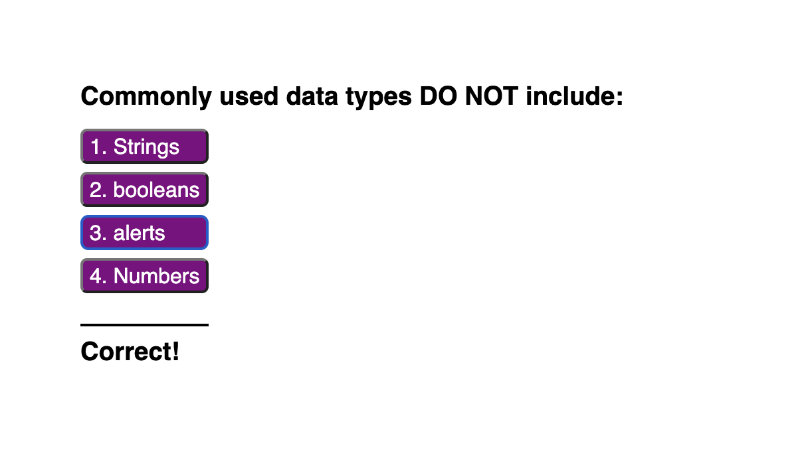

# **W4-challenge-javascript-quiz**

In week 4 challenge, we're assigned to create an online quiz application with JavaScript programming language. No starter codes were provided, so the index.HTML and style.CSS files are also created from scratch.

Although the online quiz app appears to be simple, the JavaScript mechanism behind is actually a lot more complicated. Completing this challenge required application of various JavaScript and DOM techniques, particularly:

- Traversing through the DOM elements and manipulating them using JavaScript, particularly with
    - append()
    - classList.add()
    - classList.remove()

- Controlling time intervals with 
    - setInterval()
    - clearInterval()
    - setTimeOut()

- Invoking functions with addEventListener()

- Storing and retrieving data to and from a browser localStorage with
    - localStorage.setItem("key", JSON.stringify([name of relevant array]));
    - localStorage.getItem("key", JSON.parse([name of relevant array]));

- JavaScript conditional statements and loops

## **URLs**
- [Deployed Application URL](https://jouriena11.github.io/W4-challenge-javascript-quiz/)
- [GitHub Repository URL](https://github.com/jouriena11/W4-challenge-javascript-quiz)

## **Expected Behavior**

1. The starting page looks like this:

    

    
    

2. When clicking on Start Quiz button, the quiz starts, displaying the first question.

    

    
    

The View High Score link is hidden to prevent the user from clicking the link in the middle of the quiz, the possibility of which would disrupt the flow of sequence. It is intentional that this link would only appear when the quiz introduction content is displayed (i.e., the link will be displayed again when the quiz is restarted.)

3. Once an answer button is clicked, a correct/wrong message would appear under the question:

    

    
    

    and another question would automatically replace the current question.

4. Once the last quiz question is answered, a score summary page with an option to record the score to the score board would be displayed. The final score is equivalent to the remaining time displayed on the top-right corner of the web app. The user must enter a name in order to submit the score and view the high score board:

    

    
    

    
    If the input field is left blank and the user clicks the submit button, an alert message would appear:

    

    
    

    
5. Unless the Clear High Scores button is clicked, the user would see the high score board where the score entries are sorted in a descending order according to the score value of each score record stored in the localStorage:

    

    
    

## Possible Improvement
- After the start quiz button The timer doesn't start right way